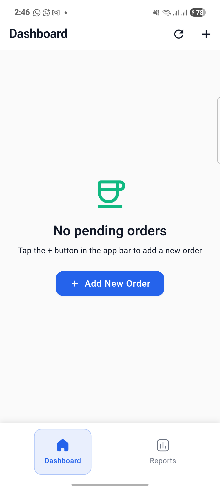
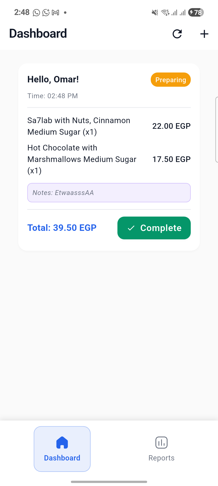
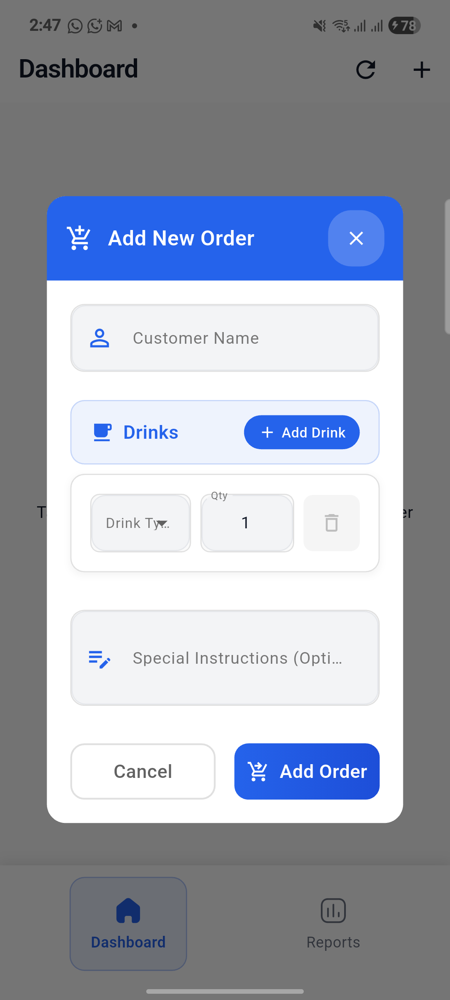
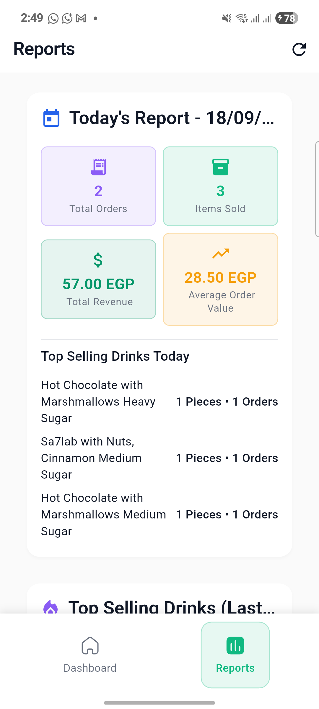
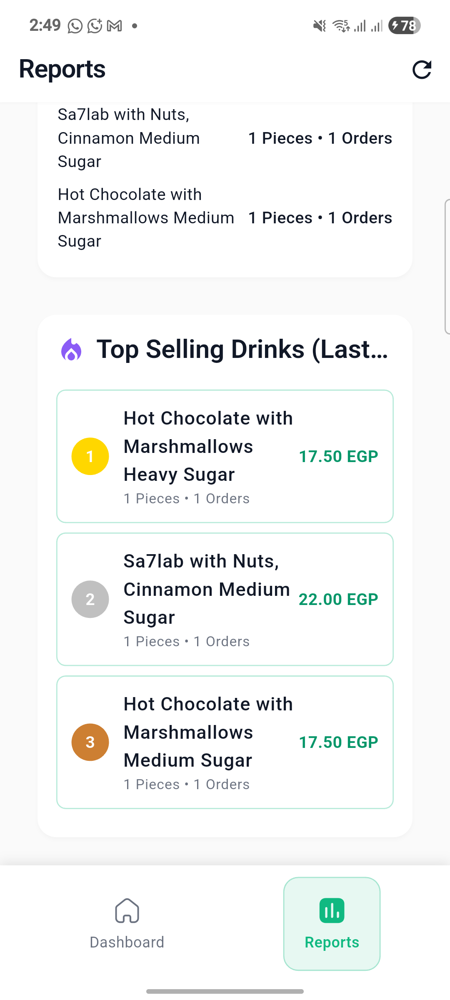

# 🫖 أهوة بلدي - Smart Ahwa Manager

<div align="center">
  
[](https://flutter.dev)
[](https://dart.dev)
[](https://pub.dev/packages/provider)
[](https://blog.cleancoder.com/uncle-bob/2012/08/13/the-clean-architecture.html)
[](https://en.wikipedia.org/wiki/SOLID)

**A professional Flutter application designed for Cairo ahwa (coffee shop) owners to streamline operations, manage customer orders, track popular items, and generate comprehensive sales reports.**

[📱 Features](#-features) • [🖼️ Screenshots](#️-screenshots) • [🏗️ Architecture](#️-architecture) • [🚀 Getting Started](#-getting-started) • [🤝 Contributing](#-contributing)

</div>

---

## 📱 Features

<details>
<summary><b>🛒 Order Management</b></summary>

- ✨ **Smart Order Creation**: Add orders with customer names, drink customizations, and special instructions
- 🔄 **Real-time Updates**: Live dashboard showing all pending orders
- ✅ **One-Click Completion**: Mark orders as completed with a single tap
- 🎯 **16 Drink Types**: Comprehensive menu including traditional Egyptian drinks
- 🔧 **Custom Options**: Sugar levels, temperature, add-ons, and special preparations

</details>

<details>
<summary><b>📊 Analytics & Reporting</b></summary>

- 📈 **Daily Sales Reports**: Comprehensive sales analysis with revenue tracking
- 🏆 **Top Selling Items**: Identify most popular drinks and customer preferences
- 💰 **Revenue Insights**: Track daily, weekly, and monthly earnings
- 📋 **Export Options**: Generate printable reports for business analysis

</details>

<details>
<summary><b>🎨 User Experience</b></summary>

- 🌍 **Arabic UI**: Fully localized Arabic interface with RTL support
- 🎯 **Intuitive Design**: Clean, modern UI following Material Design principles
- 📱 **Responsive Layout**: Optimized for tablets and smartphones
- 🌈 **Professional Theme**: Warm color palette inspired by traditional ahwa aesthetics

</details>

<details>
<summary><b>⚡ Performance & Quality</b></summary>

- 🏗️ **Clean Architecture**: Maintainable and scalable codebase
- 🧪 **SOLID Principles**: Following industry best practices
- 🔒 **Type Safety**: Full Dart null safety implementation
- 🚀 **Optimized Performance**: Smooth animations and fast loading times

</details>

---

## 🖼️ Screenshots

<div align="center">

### 🏠 Dashboard


*Real-time order tracking with clean, professional interface*

### 📝 Order Management  


*Comprehensive order creation with customer details*

### 💬 Enhanced Dialog


*Beautiful, responsive dialog with 16+ drink options*

### 📊 Sales Reports
<div style="display: flex; justify-content: center; gap: 20px;">


</div>

*Detailed analytics and business insights*

</div>

---

## 🍵 Supported Drink Menu

<div align="center">

| Traditional Egyptian | Coffee Varieties | Tea Collection | Specialty Drinks |
|---------------------|------------------|----------------|------------------|
| 🫖 **شاي (Shai)** | ☕ **قهوة تركي** | 🌿 **Green Tea** | 🍫 **Hot Chocolate** |
| 🌺 **كركديه** | ☕ **Black Coffee** | 🌱 **Mint Tea** | 🥤 **Iced Coffee** |
| 🥛 **سحلب** | ☕ **Cappuccino** | 🌟 **Anise Tea** | 🧊 **Frappe** |
| 🥛 **Milk Tea** | ☕ **Latte** | | |
| | ☕ **Americano** | | |
| | ☕ **Espresso** | | |

</div>

> **Each drink comes with customizable options**: Sugar levels, temperature preferences, milk types, and traditional add-ons like mint, cardamom, nuts, and cinnamon.

---

## 🏗️ Architecture

<div align="center">

</div>

### 🎯 Clean Architecture Implementation

This application follows **Clean Architecture** principles with a clear separation of concerns:

```
📦 lib/
├── 🎨 presentation/        # UI Layer
│   ├── pages/             # Screen widgets
│   ├── providers/         # State management
│   └── widgets/           # Reusable components
├── 🏢 domain/             # Business Logic Layer
│   ├── entities/          # Business models
│   ├── repositories/      # Abstract contracts
│   └── usecases/          # Business rules
├── 💾 data/              # Data Layer
│   ├── datasources/       # Data access
│   └── repositories/      # Repository implementations
└── ⚙️ core/              # Shared Components
    ├── constants/         # App-wide constants
    ├── di/               # Dependency injection
    └── theme/            # Styling and theming
```

### 🔧 SOLID Principles in Action

<details>
<summary><b>🎯 Single Responsibility Principle (SRP)</b></summary>

```dart
// ✅ Each class has one reason to change
class AddOrderUseCase {           // Only handles adding orders
class OrderRepository {           // Only manages order data
class OrderCard {                // Only displays order UI
class AppTheme {                 // Only handles app styling
```

</details>

<details>
<summary><b>🔓 Open/Closed Principle (OCP)</b></summary>

```dart
// ✅ Easy to extend, no need to modify existing code
abstract class Drink {
  double calculatePrice();
  String get displayName;
}

class Shai extends Drink { ... }           // ✅ New drink types
class TurkishCoffee extends Drink { ... }  // can be added easily
class MilkTea extends Drink { ... }        // without changing base class
```

</details>

<details>
<summary><b>🔄 Liskov Substitution Principle (LSP)</b></summary>

```dart
// ✅ Any Drink subclass can replace the base class
List<Drink> drinks = [
  Shai(withMint: true),
  TurkishCoffee(sugarLevel: SugarLevel.medium),
  HibiscusTea(hot: true)
]; // All work identically in OrderItem
```

</details>

<details>
<summary><b>📦 Interface Segregation Principle (ISP)</b></summary>

```dart
// ✅ Focused, specific interfaces
abstract class OrderRepository {      // Only order operations
abstract class CustomerRepository {   // Only customer operations
abstract class ReportGenerator {      // Only reporting operations
```

</details>

<details>
<summary><b>🔀 Dependency Inversion Principle (DIP)</b></summary>

```dart
// ✅ High-level modules don't depend on low-level modules
class OrderProvider {
  final OrderRepository _repository;  // Depends on abstraction
  OrderProvider(this._repository);    // Not concrete implementation
}
```

</details>

---

## 🎨 Design System

<div align="center">

### Color Palette

| Color | Hex | Usage |
|-------|-----|-------|
| 🔵 **Primary** | `#2563EB` | Main actions, headers |
| 🟤 **Primary Dark** | `#1D4ED8` | Hover states, gradients |
| 🟢 **Secondary** | `#10B981` | Success states, confirmations |
| 🟣 **Accent** | `#8B5CF6` | Highlights, special elements |
| ⚠️ **Warning** | `#F59E0B` | Caution states |
| ❌ **Error** | `#DC2626` | Error states, deletions |

</div>

### 🎭 UI Components

- **Material Design 3** principles
- **Responsive layouts** for all screen sizes  
- **Smooth animations** and transitions
- **Accessibility** features (high contrast, screen readers)
- **Arabic RTL** support throughout

---

## 🛠️ Tech Stack

<div align="center">

| Category | Technologies |
|----------|-------------|
| **Framework** |  |
| **Language** |  |
| **State Management** |  |
| **Architecture** | Clean Architecture + SOLID Principles |
| **UI Framework** | Material Design 3 |
| **Utilities** | UUID, Intl, ScreenUtil |

</div>

---

## 🚀 Getting Started

### Prerequisites

```bash
# Ensure you have Flutter installed
flutter --version
# Should show Flutter 3.7.2 or higher
```

### Installation

1. **Clone the repository**
   ```bash
   git clone https://github.com/mahmoudhatems/ahwa_balady.git
   cd ahwa_balady
   ```

2. **Install dependencies**
   ```bash
   flutter pub get
   ```

3. **Run the application**
   ```bash
   # For development
   flutter run
   
   # For release build
   flutter build apk --release
   ```

### 🔧 Development Setup

```bash
# Enable hot reload for faster development
flutter run --hot

# Run tests
flutter test

# Analyze code quality
flutter analyze
```

---

## 📱 Platform Support

| Platform | Status | Notes |
|----------|--------|-------|
| **Android** | ✅ | Fully supported (API 21+) |
| **iOS** | ✅ | Fully supported (iOS 12+) |
| **Web** | ✅ | Progressive Web App ready |
| **Desktop** | 🔄 | Windows/macOS/Linux compatible |

---

## 🤝 Contributing

### 💻 Code Contributions
1. Fork the repository
2. Create a feature branch (`git checkout -b feature/amazing-feature`)
3. Follow the coding standards
4. Add tests for new functionality
5. Submit a pull request

### 📝 Coding Standards
- Follow [Dart style guide](https://dart.dev/guides/language/effective-dart/style)
- Use meaningful variable and function names
- Add documentation for public APIs
- Maintain test coverage above 80%

---


<div align="center">

**Made with ❤️ for Egyptian coffee culture 🇪🇬 🐦‍🔥⃤⃟⃝🦅 **

</div>
